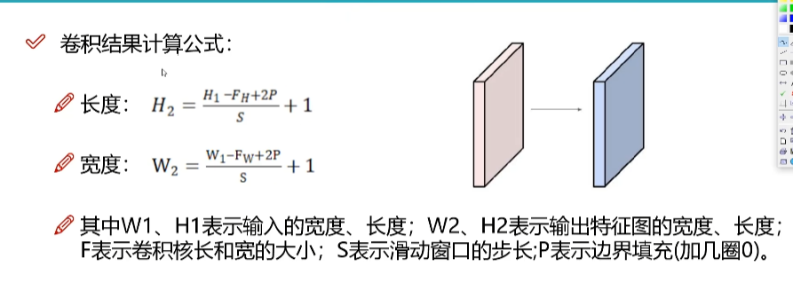
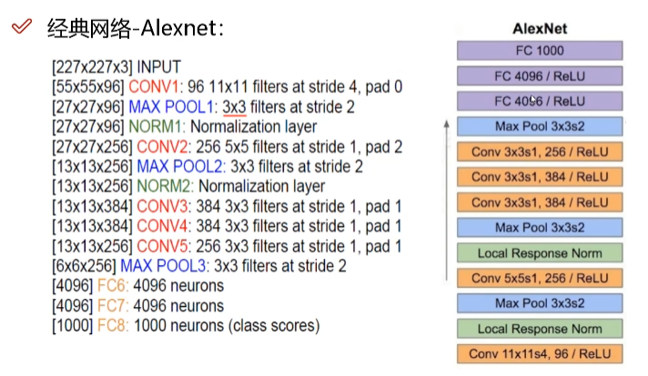

# RNN

## 卷积神经网络整体架构
- 输入层  
- 卷积层 ： 提取特征
- 池化层 ： 压缩特征
- 全连接层 
- 输出层

## 卷积做了一个什么事情？
把一张图像分成了很多部分 不同的部分分开对待 得到特征不一样
通过卷积变成特征图 对于每一个部分得到的特征是不一样的

### 图像的颜色通道

经常见到的是 `RGB` 三颜色的颜色通道

> 32 * 32 * 3

三个颜色通道分别做计算

filter 多大的区域计算多大的值

所有卷积网络当中都是用内积做计算的

**什么是内积？**
对应位置相乘 所有结果加在一起

> 只做一次卷积就可以了吗 需要做很多次卷积

# 卷积层涉及的参数

- 滑动窗口的步长： 移动大小/长度不一样 步长越小 得到的输出的结果越大
 - 步长越小 图像特征提取的越仔细 图像一般步长都是走1
- 卷积核的尺寸 ： 选择区域的大小 卷积核越小 越细
 - 一般都是步长为1 卷积核3*3
- 边缘填充： 有些重合值 影响比较大
 - 越往边界的点被最终结果利用的次数越少， 越往中间的点被最终结果利用的次数越多 
 - 中间重要， 边界不重要 怎么办？ 就是边缘填充， 就一定程度上弥补了边界信息利用不充分的问题
- 卷积核个数： 最终算的过程中 要得到多少个特征图

# 卷积结果计算公式

# 池化层

卷积时多提取特征 池化叫压缩 = 下采样

## 最大池化

> 只能修改长宽

- maxpooling： 每个区域拿出最大的值
- averagepooling : 每个区域拿出平均值 现在很少见 

> 池化层没有涉及任何矩阵计算

卷积层都和relu搭配在一起
CONV + RELU 
两次卷积 + 一次池化

最后想要概率 还得要全连接层

# 经典的网络架构 比较老

Alexnet 12年夺冠的网络

